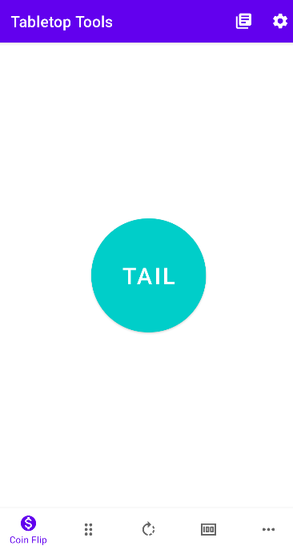
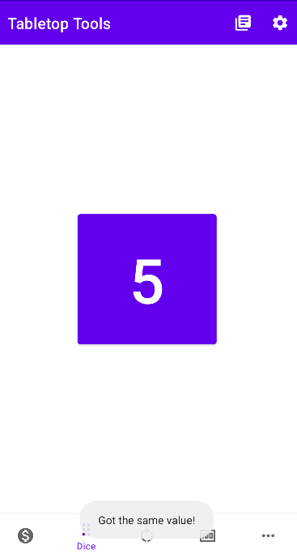
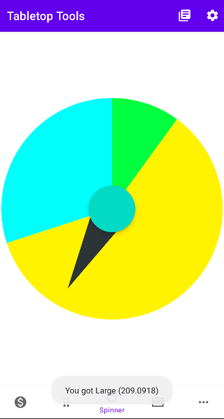
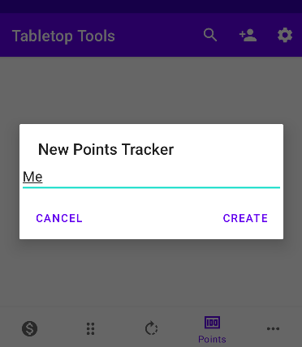
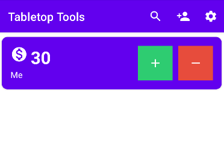

# Tabletop Tools
A virtual tabletop tools all in one. Containing feature such as a coin flipper, dice roller,
and a spinner all with adjustable probability. The app also have a built in points tracker along
with history tracker for all previously mentioned features.

## How to Use
* Click on the icons and buttons.
* Swipe left to remove a card and swipe right to edit it! (No edit for history cards)

## Download
[Download the latest release here](https://github.com/tabletop-tool/tabletop-tools-android/releases/latest)

### Coin Flipper

### Dice Roller

### Spinner

### Points Tracker

### External Resources
* Icons made by [Freepik](https://www.freepik.com) from [Flaticon](www.flaticon.com)
